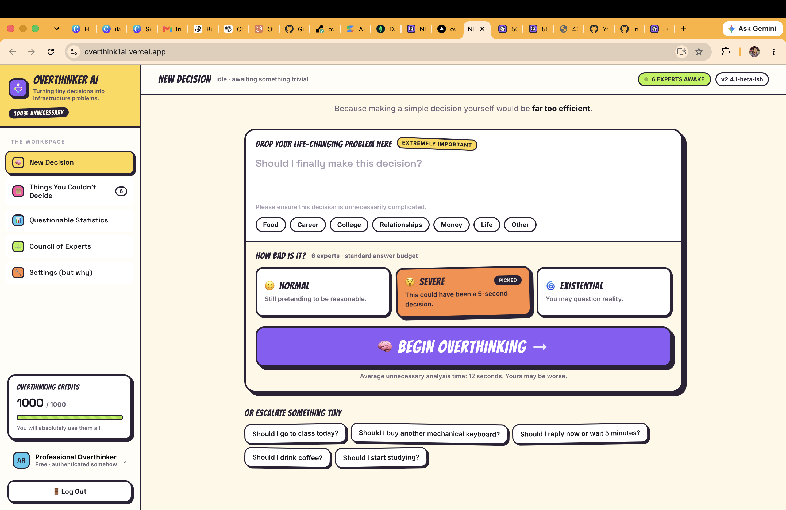
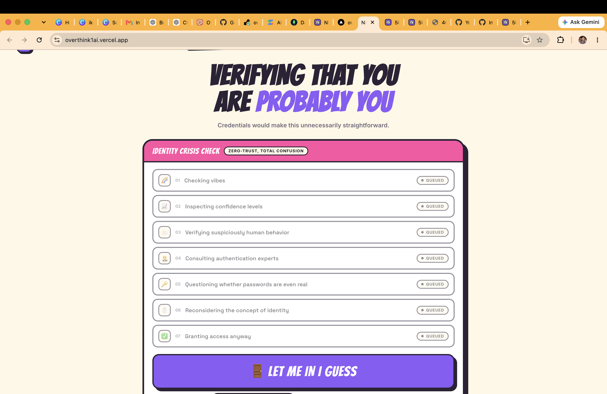
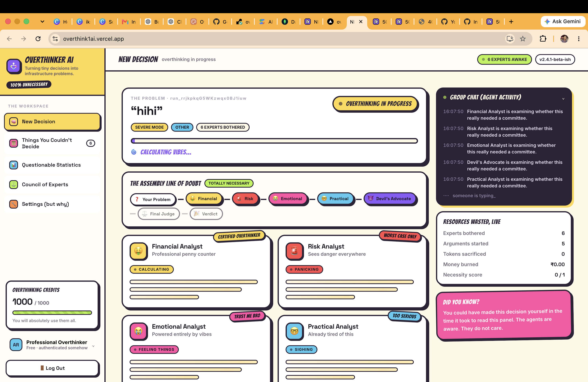
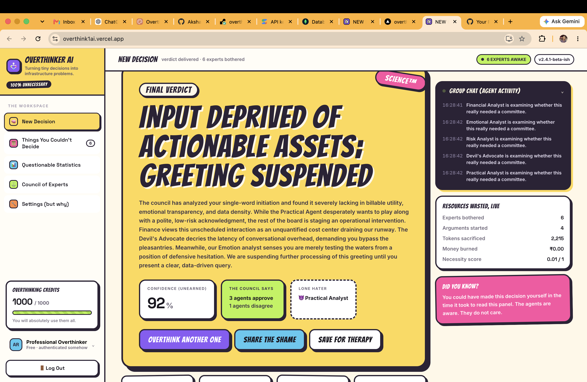

<p align="center">
  
</p>

# Overthinker AI 🤯

> Why make a simple decision in 10 seconds when AI can overthink it for you?

Overthinker AI is a React 18/Vite single-page application backed by FastAPI and MongoDB. It convenes multiple AI agents to analyse a decision, streams their progress over SSE, and persists verdicts, history, analytics, settings, agents, sessions, and credit usage.

## Basic Details

### Team Name

Overthinker AI

### Team Members

- **Akshath O K** — St. Joseph's College (Autonomous), Devagiri

### Project Description

**Overthinker AI** is an AI-powered decision-making platform that takes simple everyday dilemmas and analyses them far more deeply than necessary.

Multiple AI agents examine the same decision from different perspectives, debate the possibilities, and eventually provide an unnecessarily well-thought-out verdict.

### The Problem (that doesn't exist)

Making decisions is dangerously simple. Normal people can answer questions like:

- Should I order biriyani or pizza?
- Should I send this message?
- Should I sleep now or watch another episode?
- Should I buy something I definitely don't need?

...within a few seconds. This level of efficiency is unacceptable.

People deserve the opportunity to question every possible consequence, imagine situations that will probably never happen, and turn an ordinary decision into a full-scale existential crisis.

### The Solution (that nobody asked for)

Instead of giving you one boring, straightforward answer, Overthinker AI sends your decision through multiple specialised AI agents. Each agent examines the dilemma differently—analysing logic, risks, emotions, consequences, and unnecessarily complicated hypothetical situations—before their analyses are combined into a final verdict.

Because sometimes you don't need an answer. You need **17 more reasons to doubt yourself.**

## Technical Details

### Software

- JavaScript and JSX
- React 18 and Vite
- Python and FastAPI
- MongoDB and PyMongo
- Gemini/OpenAI provider integration
- REST API and Server-Sent Events (SSE)
- HTML5 and CSS3
- Git, GitHub, Vercel, and Render

### Hardware

No hardware required. Humans already come with the only hardware needed for overthinking: **the brain. 🧠**

## Screenshots

### Guest Access



*Credentials would make this unnecessarily straightforward, so the application supports a secure guest session.*

### New Decision


*Enter the completely ordinary decision you would like to unnecessarily complicate.*

### Live AI Analysis



*Multiple AI agents analyse the decision from different perspectives while live progress streams into the interface.*

### Final Verdict



*The council delivers its unnecessarily confident final verdict after every available angle has been thoroughly overthought.*

## Workflow

```text
User enters a decision
        ↓
Decision sent to FastAPI backend
        ↓
Analysis session created
        ↓
Multiple specialist agents activated
        ↓
Logic · Risk · Emotion · Practicality · Devil's Advocate
        ↓
Live progress streamed to the React UI
        ↓
Agent results combined by the final judge
        ↓
Verdict saved to history and analytics
        ↓
User still doesn't know what to do
```

## Project Demo

- 🌐 **Live website:** [overthink1ai.vercel.app](https://overthink1ai.vercel.app/)
- 💻 **GitHub repository:** [Akshath6060/overthink.ai](https://github.com/Akshath6060/overthink.ai)

## Local development

Frontend (Node.js 18+):

```bash
cd overthinker-app
cp .env.example .env
npm install
npm run dev
```

Backend (Python 3.11–3.13):

```bash
cd backend
python3 -m venv .venv
source .venv/bin/activate
pip install -r requirements.txt
cp .env.example .env
uvicorn app.main:app --reload --host 127.0.0.1 --port 8000
```

For credential-free local backend work, explicitly set `AI_PROVIDER=mock`. In-memory storage and the mock provider are rejected when `APP_ENV=production`.

# Production Deployment

## Frontend

```bash
cd overthinker-app
npm ci
npm run build
```

Deploy `overthinker-app/dist/` as the static output. The build includes SPA fallbacks and security/cache headers for Vercel and Netlify/Cloudflare Pages. Unknown UI routes resolve to `index.html`; `/api/*` is excluded from the SPA fallback. The only indexable route is `/` and authenticated application routes set `noindex,nofollow` at runtime.

The production build must receive `VITE_APP_ENV=production`, `VITE_APP_URL`, and `VITE_API_BASE_URL`. `VITE_APP_URL` also generates `public/sitemap.xml` during `prebuild` and makes canonical/Open Graph URLs absolute. Only public values belong in `VITE_*` variables.

## Backend

The included [Dockerfile](backend/Dockerfile) starts the existing FastAPI service with:

```bash
uvicorn app.main:app --host 0.0.0.0 --port "$PORT"
```

Deploy it on Render using [render.yaml](backend/render.yaml), or use the same container on Railway, Fly.io, ECS, or another container platform. Configure `/health` as the liveness check and `/health/ready` as readiness. Use one web worker while analysis jobs and rate limiting remain in process.

## Required environment variables

| Variable | Required | Scope | Description | Example format |
| --- | --- | --- | --- | --- |
| `VITE_API_BASE_URL` | Production | Frontend | Public API origin; omit `/api/v1` | `https://api.example.com` |
| `VITE_APP_URL` | Production | Frontend | Canonical public origin | `https://app.example.com` |
| `VITE_APP_ENV` | Production | Frontend | Enables strict config validation | `production` |
| `APP_ENV` | Production | Backend | Runtime safety mode | `production` |
| `MONGODB_URI` | Production | Backend | MongoDB connection string | `mongodb+srv://…` |
| `MONGODB_DATABASE` | Yes | Backend | Database name | `overthinker` |
| `AI_PROVIDER` | Yes | Backend | Active provider | `gemini` or `openai` |
| `GEMINI_API_KEY` | Conditional | Backend | Required for Gemini | Secret value |
| `GEMINI_MODEL` | Gemini | Backend | Primary analyst model | `gemini-3.6-flash` |
| `GEMINI_JUDGE_MODEL` | Gemini | Backend | Primary verdict model | `gemini-3.6-flash` |
| `GEMINI_FALLBACK_MODEL` | Recommended | Backend | Capacity/retirement fallback model | `gemini-3.5-flash` |
| `OPENAI_API_KEY` | Conditional | Backend | Required for OpenAI | Secret value |
| `SESSION_SECRET` | Production | Backend | At least 32 random characters | Random secret |
| `FRONTEND_URL` | Production | Backend | Primary allowed HTTPS origin | `https://app.example.com` |
| `ALLOWED_ORIGINS` | Optional | Backend | Additional comma-separated HTTPS origins | `https://www.example.com` |
| `COOKIE_SECURE` | Production | Backend | Restricts session cookie to HTTPS | `true` |
| `COOKIE_SAMESITE` | Yes | Backend | Use `none` for separate sites, otherwise `lax`/`strict` | `none` |
| `LOG_LEVEL` | Yes | Backend | Structured log threshold | `INFO` |
| `DOCS_ENABLED` | Recommended false | Backend | Exposes OpenAPI documentation | `false` |

Other model, allowance, and expiry settings are documented in [backend/.env.example](backend/.env.example). No real secrets belong in any committed `.env` file.

## HTTPS, cookies, and CORS

Expose both services only over HTTPS. Production startup rejects insecure cookies, wildcard/non-HTTPS CORS origins, in-memory MongoDB, mock AI, weak session secrets, and missing active-provider keys. Sessions are random, stored server-side as HMAC hashes, and delivered as `Secure`, `HttpOnly` cookies. When frontend and API are on separate sites, use `COOKIE_SAMESITE=none`; a same-site `api.example.com` arrangement is preferable.

## Hosting notes

- Vercel: set root directory to `overthinker-app`, build command `npm run build`, output `dist`.
- Netlify: set base directory to `overthinker-app`, publish directory `dist`; `_redirects` and `_headers` are copied automatically.
- Cloudflare Pages: set root to `overthinker-app`, build command `npm run build`, output `dist`; `_redirects` and `_headers` are supported.
- Backend: Render is preconfigured. Railway, Fly.io, and AWS can build `backend/Dockerfile` unchanged.
- CDN/static hosts normally apply Brotli/gzip automatically. The backend enables gzip for suitable API responses.
- Hashed `/assets/*` files are immutable for one year; HTML is never immutable.

After assigning the final domains, run through [PRODUCTION_CHECKLIST.md](PRODUCTION_CHECKLIST.md). The generated social image lives at `overthinker-app/public/og-image.png`; replace it only if brand artwork changes.

## Verification

```bash
cd overthinker-app && npm run build
cd ../backend && .venv/bin/pytest -q
```

## Team Contributions

- **Akshath O K:** Project concept, UI/UX design, frontend development, backend development, AI integration, database integration, testing, and deployment.

## Why did I build this?

AI is becoming incredibly powerful at solving difficult real-world problems.

So naturally, I decided to use it for questions like:

> Should I reply with "okay" or "ok"?

A completely reasonable application of modern artificial intelligence.

## Future Scope 🚀

- Overthinking intensity slider
- More AI personalities
- Agent-vs-agent debate mode
- "What could possibly go wrong?" generator
- Regret prediction
- More completely unnecessary statistics
- One-click **Just Decide For Me** button
- Emergency **STOP OVERTHINKING** mode

---

Made with ❤️, questionable decisions, and unnecessary computation at **TinkerHub Useless Projects**.

[](https://www.tinkerhub.org/)
[](https://tinkerhub.org/events/1M8ORET9A1/useless-projects-3.0)
